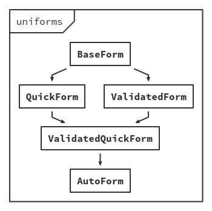

# Table of Contents

- [Installation](#installation)
    - [meteor](#meteor)
    - [npm](#npm)
- [Quick start](#quick-start)
- [Overview](#overview)
    - [Forms components](#forms-components)
    - [Fields components](#fields-components)
- [Advanced topics](#advanced-topics)
    - [Forms](#forms)
        - [Asynchronous validation](#asynchronous-validation)
        - [Autosave](#autosave)
        - [Hierarchy](#hierarchy)
        - [Methods](#methods)
        - [Model transformations](#model-transformations)
        - [Post-submit handling](#post-submit-handling)
        - [Validation options and modes](#validation-options-and-modes)
        - [Example: `ModifierForm`](#example-modifierform)
    - [Fields](#fields)
        - [`AutoField` algorithm](#autofield-algorithm)
        - [Guaranteed props](#guaranteed-props)
        - [Props propagation](#props-propagation)
        - [Example: `CompositeField`](#example-compositefield)
        - [Example: `CustomAutoField`](#example-customautofield)
        - [Example: `CycleField`](#example-cyclefield)
        - [Example: `RangeField`](#example-rangefield)
        - [Example: `RatingField`](#example-ratingfield)
    - [Schemas](#schemas)
        - [GraphQL definition](#graphql-definition)
        - [SimpleSchema definition](#simpleschema-definition)
        - [Example: `MyLittleSchema`](#example-mylittleschema)
    - [Context data](#context-data)
        - [Available context data](#available-context-data)
        - [Example: `DisplayIf`](#example-displayif)
        - [Example: `SubmitButton`](#example-submitbutton)
        - [Example: `SwapField`](#example-swapfield)
- [Troubleshooting](#troubleshooting)

<br>

# Installation

**Note:** If you are going to use a themed package - remember to include correct styles!

## meteor

**Note:** If you prefer video, there's [Meteor University](https://meteoruniversity.org/) uniforms session available [here](https://www.youtube.com/watch?v=bTHPoghqtS4).

These are npm packages, so they can't imply any Meteor package, and you have to install dependencies manually. In your Meteor app directory:

```shell
# If you are going to use SimpleSchema
$ meteor add aldeed:simple-schema check

# If you are going to use SimpleSchema@2
$ meteor npm install simpl-schema

# If you are going to use GraphQL
$ meteor npm install graphql

# Components (pick one)
$ meteor npm install --save react react-dom uniforms uniforms-antd
$ meteor npm install --save react react-dom uniforms uniforms-bootstrap3
$ meteor npm install --save react react-dom uniforms uniforms-bootstrap4
$ meteor npm install --save react react-dom uniforms uniforms-material
$ meteor npm install --save react react-dom uniforms uniforms-semantic
$ meteor npm install --save react react-dom uniforms uniforms-unstyled
```

## npm

```shell
# Components (pick one)
$ npm install --save react react-dom uniforms uniforms-antd
$ npm install --save react react-dom uniforms uniforms-bootstrap3
$ npm install --save react react-dom uniforms uniforms-bootstrap4
$ npm install --save react react-dom uniforms uniforms-material
$ npm install --save react react-dom uniforms uniforms-semantic
$ npm install --save react react-dom uniforms uniforms-unstyled
```

<br>

# Quick start

**Note:** The following examples are designed to work out of the box in meteor with `SimpleSchema` (a very common schema in the meteor community), but it's not mandatory and you can easily use it without meteor and with different schemas (see: [Custom Schema](#schemas)). There's also GraphQL support.

Let's start with defining an example schema:

```js
// Choose your theme
import AutoForm from 'uniforms-unstyled/AutoForm';

// A compatible schema
import PostSchema from './schemas/Post';

// This will render an automatic, validated form, with labelled fields, inline
// validation and a submit button. If model will be present, form will be filled
// with appropriate values.
const PostForm = ({model}) =>
    <AutoForm schema={PostSchema} onSubmit={doc => db.save(doc)} model={model} />
;
```

That's all! `AutoForm` will generate a complete form with labelled fields, errors list (if any) and a submit button. Also, it will take care of validation and handle model changes.

If you want to use custom HTML code inside your form you can include the form content.

```javascript
// Choose your theme
import AutoField from 'uniforms-unstyled/AutoField';
import AutoForm from 'uniforms-unstyled/AutoForm';
import TextField from 'uniforms-unstyled/TextField';
import SubmitField from 'uniforms-unstyled/SubmitField';

// A compatible schema
import PostSchema from './schemas/Post';

const PostForm = ({ model }) => (
    <AutoForm schema={PostSchema} onSubmit={doc => db.save(doc)} model={model}>
        <h2>Title</h2>
        <AutoField name="myField" />
        <TextField name="otherField" />
        <div className="pull-right">
            <SubmitField className="btn btn-primary" />
        </div>
    </AutoForm>
);
```

<br>

# Overview

**Note:** For a full description of components and their props - see [API](https://github.com/vazco/uniforms/blob/master/API.md).

## Forms components

Most of the time you'll be using either `AutoForm` or `ValidatedForm`, but there are also other form components (rather low-level ones) with different capabilities.

| Component            | Self-generated? | Self-managed? | Self-validated? |
|:--------------------:|:---------------:|:-------------:|:---------------:|
| `AutoForm`           | ✔               | ✔             | ✔               |
| `BaseForm`           | ✘               | ✘             | ✘               |
| `QuickForm`          | ✔               | ✘             | ✘               |
| `ValidatedForm`      | ✘               | ✘             | ✔               |
| `ValidatedQuickForm` | ✔               | ✘             | ✔               |

## Fields components

This is a guaranteed set of fields - every theme package will implement these, but also can provide additional ones.

| Component       | Description                                     |
|:---------------:|:-----------------------------------------------:|
| `AutoField`     | Automatically renders a given field.            |
| `AutoFields`    | Automatically renders given fields.             |
| `BoolField`     | Checkbox.                                       |
| `DateField`     | HTML5 `datetime-local` input.                   |
| `ErrorField`    | Error message for a given field.                |
| `ErrorsField`   | Error message with a list of validation errors. |
| `HiddenField`   | Hidden field (with possibility to omit in DOM). |
| `ListAddField`  | An icon with action to add a list item.         |
| `ListDelField`  | An icon with action to remove a list item.      |
| `ListField`     | List of nested fields.                          |
| `ListItemField` | Single list item wrapper.                       |
| `LongTextField` | Textarea.                                       |
| `NestField`     | Block of nested fields.                         |
| `NumField`      | Numeric input.                                  |
| `RadioField`    | Radio checkbox.                                 |
| `SelectField`   | Select (or set of radio checkboxes).            |
| `SubmitField`   | Submit button.                                  |
| `TextField`     | Text (or any HTML5 compatible) input.           |

<br>

# Advanced topics

## Forms

### Asynchronous validation

`ValidatedForm` (and so `AutoForm`) has an `onValidate` prop. It can be used to create an asynchronous validation:

```js
const onValidate = (model, error, callback) => {
    // You can either ignore validation error...
    if (omitValidation(model)) {
        return callback(null);
    }

    // ...or any additional validation if an error is already there...
    if (error) {
        return callback();
    }

    // ...or feed it with another error.
    MyAPI.validate(model, error => callback(error || null));
};

// Later...

<ValidatedForm {...props} onValidate={onValidate} />
```

### Autosave

Every form has an autosave functionality. If you set an `autosave` prop, then every change will trigger a submit. There's also an `autosaveDelay` prop - a minimum time between saves in milliseconds (default: `0`).

**Example:**

```js
<AutoForm
    autosave
    autosaveDelay={5000} // 5 seconds
    schema={schema}
    onSubmit={onSubmit}
/>
```

### Hierarchy

<p align="center">
    
</p>

### Methods

You can use [React `ref` prop](https://facebook.github.io/react/docs/more-about-refs.html) to manually access form methods. Example usage:

```js
const MyForm = ({schema, onSubmit}) => {
    let formRef;

    return (
        <section>
            <AutoForm ref={ref => formRef = ref} schema={schema} onSubmit={onSubmit} />
            <small onClick={() => formRef.reset()}>
                Reset
            </small>
            <small onClick={() => formRef.submit()}>
                Submit
            </small>
        </section>
    );
};
```

All available methods:

* `change(key, value)`
* `reset()`
* `submit()`
* `validate()` _(added in `ValidatedForm`)_

### Model transformations

If you need to transform model before it will be validated, submitted or passed down to the fields, there's a `modelTransform` prop, which should be used in those use cases.

**Example:**

```js
<AutoForm
    // Do not mutate given model!
    modelTransform={(mode, model) => {
        // This model will be passed to the fields.
        if (mode === 'form') {/* ... */}

        // This model will be submitted.
        if (mode === 'submit') {/* ... */}

        // This model will be validated.
        if (mode === 'validate') {/* ... */}

        // Otherwise, return unaltered model.
        return model;
    }}
    onSubmit={onSubmit}
    schema={schema}
/>
```

### Post-submit handling

It's a good UX practice to tell your users that something failed or succeed. To make it simpler, there are `onSubmitFailure` and `onSubmitSuccess` props.

**Example:**

```js
<AutoForm
    schema={schema}
    onSubmit={doc => db.saveThatReturnsPromise(doc)}
    onSubmitSuccess={() => alert('Promise resolved!')}
    onSubmitFailure={() => alert('Promise rejected!')}
/>
```

### Validation options and modes

Any form can be validated in one those three styles:

* `onChange`
    Validate on every change.

* `onChangeAfterSubmit` _(default)_
    Validate on every change, but only after first submit.

* `onSubmit`
    Validate on every submit.

If your schema validator accepts any options, those can be passed in `validator` prop.

**Example:**

```js
<AutoForm
    validate="onChange"
    validator={validatorOptions}
    schema={schema}
    onSubmit={onSubmit}
/>
```

### Example: `ModifierForm`

```js
import BaseForm from 'uniforms/BaseForm';

// In uniforms, every form is just an injectable set of functionalities. Thus,
// we can live without many higher order components, using composed ones
// instead. If you want to get a deeper dive into it, read the source of
// AutoForm or QuickForm in the core package.
const Modifier = parent => class extends parent {
    // Expose injector.
    //   It's not required, but recommended.
    static Modifier = Modifier;

    // Alter component display name.
    //   It's not required, but recommended.
    static displayName = `Modifier${parent.displayName}`;

    // Here you can override any form methods or create additional ones.
    getModel (mode) {
        if (mode === 'submit') {
            const doc  = super.getModel('submit');
            const keys = this.getChildContextSchema().getSubfields();

            const update = keys.filter(key => doc[key] !== undefined);
            const remove = keys.filter(key => doc[key] === undefined);

            // It's a good idea to omit empty modifiers.
            const $set   = update.reduce((acc, key) => ({...acc, [key]: doc[key]}), {});
            const $unset = remove.reduce((acc, key) => ({...acc, [key]: ''}), {});

            return {$set, $unset};
        }

        return super.getModel(mode);
    }
};

// Now we have to inject our functionality. This one is a ModifierForm. Use any
// form component you want.
export default Modifier(BaseForm);
```

## Fields

### `AutoField` algorithm

```js
let component = props.component;
if (component === undefined) {
    if (props.allowedValues) {
        if (props.checkboxes && props.fieldType !== Array) {
            component = RadioField;
        } else {
            component = SelectField;
        }
    } else {
        switch (props.fieldType) {
            case Date:    component = DateField; break;
            case Array:   component = ListField; break;
            case Number:  component = NumField;  break;
            case Object:  component = NestField; break;
            case String:  component = TextField; break;
            case Boolean: component = BoolField; break;
        }

        invariant(component, 'Unsupported field type: %s', props.fieldType.toString());
    }
}
```

### Guaranteed props

**Note:** These are **not** the only props that a field will receive - these are guaranteed for all fields created with `connectField` helper.

| Name           | Type                  | Description                            |
|:--------------:|:---------------------:|:--------------------------------------:|
| `changed`      | `bool`                | Has field changed?                     |
| `disabled`     | `bool`                | Is field disabled?                     |
| `error`        | `object`              | Field scoped part of validation error. |
| `errorMessage` | `string`              | Field scoped validation error message. |
| `field`        | `object`              | Field definition from schema.          |
| `fields`       | `arrayOf(string)`     | Subfields names.                       |
| `fieldType`    | `func`                | Field type.                            |
| `findError`    | `func(name)`          | Request another field error.           |
| `findField`    | `func(name)`          | Request another field field.           |
| `findValue`    | `func(name)`          | Request another field value.           |
| `id`           | `string`              | Field id - given or random.            |
| `label`        | `string`              | Field label.                           |
| `name`         | `string`              | Field name.                            |
| `onChange`     | `func(value, [name])` | Change field value.                    |
| `parent`       | `object`              | Parent field props.                    |
| `placeholder`  | `string`              | Field placeholder.                     |
| `value`        | `any`                 | Field value.                           |

### Props propagation

Few props propagate in a very special way. These are `label`, `placeholder` and `disabled`.

**Example:**

```js
<TextField />                    // default label | no      placeholder
<TextField label="Text" />       // custom  label | no      placeholder
<TextField label={false} />      // no      label | no      placeholder
<TextField placeholder />        // default label | default placeholder
<TextField placeholder="Text" /> // default label | custom  placeholder

<NestField label={null}> // null = no label but the children have their labels
    <TextField />
</NestField>

<NestField label={false}> // false = no label and the children have no labels
    <TextField />
</NestField>

<ListField name="authors" disabled>   // Additions are disabled...
    <ListItemField name="$" disabled> // ...deletion too
        <NestField disabled={false}>  // ...but editing is not.
            <TextField name="name" />
            <NumField  name="age" />
        </NestField>
    </ListItemField>
</ListField>
```

**Note:** `label`, `placeholder` and `disabled` are cast to `Boolean` before being passed to nested fields.

### Example: `CompositeField`

**Note:** This example uses `connectField` helper. To read more see [API](https://github.com/vazco/uniforms/blob/master/API.md#connectfield).

```js
import AutoField    from 'uniforms/AutoField';
import React        from 'react';
import connectField from 'uniforms/connectField';

// This field is a kind of a shortcut for few fields. You can also access all
// field props here, like value or onChange for some extra logic.
const Composite = () =>
    <section>
        <AutoField field="firstName" />
        <AutoField field="lastName" />
        <AutoField field="age" />
    </section>
;

export default connectField(Composite);
```

### Example: `CustomAutoField`

**Note:** This example uses `connectField` helper. To read more see [API](https://github.com/vazco/uniforms/blob/master/API.md#connectfield).

```js
// Remember to choose a correct theme package
import AutoField from 'uniforms-unstyled/AutoField';

const CustomAuto = props => {
    // This way we don't care about unhandled cases - we use default
    // AutoField as a fallback component.
    const Component = determineComponentFromProps(props) || AutoField;

    return (
        <Component {...props} />
    );
};

const CustomAutoField = connectField(CustomAuto, {
    ensureValue:    false,
    includeInChain: false,
    initialValue:   false
});
```

You can also tell your `AutoForm`/`QuickForm`/`ValidatedQuickForm` to use it.

```js
<AutoForm {...props} autoField={CustomAutoField} />
```

### Example: `CycleField`

**Note:** This example uses `connectField` helper. To read more see [API](https://github.com/vazco/uniforms/blob/master/API.md#connectfield).

```js
import React        from 'react';
import classnames   from 'classnames';
import connectField from 'uniforms/connectField';

// This field works as follows: iterate all allowed values and optionally no-value
// state if the field is not required. This one uses Semantic-UI.
const Cycle = ({allowedValues, disabled, label, required, value, onChange}) =>
    <a
        className={classnames('ui', !value && 'basic', 'label')}
        onClick={() =>
            onChange(value
                ? allowedValues.indexOf(value) === allowedValues.length - 1
                    ? required
                        ? allowedValues[0]
                        : null
                    : allowedValues[allowedValues.indexOf(value) + 1]
                : allowedValues[0]
            )
        }
    >
        {value || label}
    </a>
;

export default connectField(Cycle);
```

### Example: `RangeField`

**Note:** This example uses `connectField` helper. To read more see [API](https://github.com/vazco/uniforms/blob/master/API.md#connectfield).

```js
import React        from 'react';
import connectField from 'uniforms/connectField';

// This field works as follows: two datepickers are bound to each other. Value is
// a {start, stop} object.
const Range = ({onChange, value: {start, stop}}) =>
    <section>
        <DatePicker max={stop}  value={start} onChange={start => onChange(start, stop)} />
        <DatePicker min={start} value={stop}  onChange={stop  => onChange(start, stop)} />
    </section>
;

export default connectField(Range);
```

### Example: `RatingField`

**Note:** This example uses `connectField` helper. To read more see [API](https://github.com/vazco/uniforms/blob/master/API.md#connectfield).

```js
import React        from 'react';
import classnames   from 'classnames';
import connectField from 'uniforms/connectField';

// This field works as follows: render stars for each rating and mark them as
// filled, if rating (value) is greater. This one uses Semantic-UI.
const Rating = ({className, disabled, max = 5, required, value, onChange}) =>
    <section className={classnames('ui', {disabled, required}, className, 'rating')}>
        {[...Array(max)].map((_, index) => index + 1).map(index =>
            <i
                key={index}
                className={classnames(index <= value && 'active', 'icon')}
                onClick={() => disabled || onChange(!required && value === index ? null : index)}
            />
        )}
    </section>
;

export default connectField(Rating);
```

## Schemas

To make use of any schema, uniforms have to create a _bridge_ of it - a unified schema mapper. A bridge is (preferably) a subclass of `Bridge`, implementing static `check(schema)` method and these instance methods:

- `getError(name, error)`
- `getErrorMessage(name, error)`
- `getErrorMessages(error)`
- `getField(name)`
- `getInitialValue(name, props)`
- `getProps(name, props)`
- `getSubfields(name)`
- `getType(name)`
- `getValidator(options)`

Currently built-in bridges:

- `GraphQLBridge`
- `SimpleSchemaBridge`
- `SimpleSchema2Bridge`

**Note:** To read more see [API](https://github.com/vazco/uniforms/blob/master/API.md#bridge) and [`Bridge`](https://github.com/vazco/uniforms/blob/master/packages/uniforms/src/bridges/Bridge.js).

### GraphQL definition

```js
import GraphQLBridge    from 'uniforms/GraphQLBridge';
import {buildASTSchema} from 'graphql';
import {parse}          from 'graphql';

const schema = `
    type Author {
        id:        String!
        firstName: String
        lastName:  String
    }

    type Post {
        id:     Int!
        author: Author!
        title:  String
        votes:  Int
    }

    # This is required by buildASTSchema
    type Query { anything: ID }
`;

const schemaType = buildASTSchema(parse(schema)).getType('Post');
const schemaData = {
    id: {
        allowedValues: [1, 2, 3]
    },
    title: {
        options: [
            {label: 1, value: 'a'},
            {label: 2, value: 'b'}
        ]
    }
};

const schemaValidator = model => {
    const details = [];

    if (!model.id) {
        details.push({name: 'id', message: 'ID is required!'});
    }

    // ...

    if (details.length) {
        throw {details};
    }
};

const bridge = new GraphQLBridge(schemaType, schemaValidator, schemaData);

// Later...

<ValidatedForm schema={bridge} />
```

### SimpleSchema definition

**Note:** remember to import `uniforms` packages first.

```js
const PersonSchema = new SimpleSchema({
    // ...

    aboutMe: {
        type: String,
        uniforms: MyText       // Component...
        uniforms: {            // ...or object...
            component: MyText, // ...with component...
            propA: 1           // ...and/or extra props.
        }
    }
});
```

### Example: `MyLittleSchema`

**Note:** This is a very basic schema just to show how it works and how you can create your own schema bridges.

```js
import Bridge from 'uniforms/Bridge';

class MyLittleSchema extends Bridge {
    constructor (schema, validator) {
        super();

        this.schema    = schema;
        this.validator = validator;
    }

    getError (name, error) {
        return error && error[name];
    }

    getErrorMessage (name, error) {
        return error && error[name];
    }

    getErrorMessages (error) {
        return error
            ? Object.keys(this.schema).map(field => error[field])
            : [];
    }

    getField (name) {
        return this.schema[name.replace(/\.\d+/g, '.$')];
    }

    getType (name) {
        return this.schema[name.replace(/\.\d+/g, '.$')].__type__;
    }

    getProps (name) {
        return this.schema[name.replace(/\.\d+/g, '.$')];
    }

    getInitialValue (name) {
        return this.schema[name.replace(/\.\d+/g, '.$')].initialValue;
    }

    getSubfields (name) {
        return name
            ? this.schema[name.replace(/\.\d+/g, '.$')].subfields || []
            : Object.keys(this.schema).filter(field => field.indexOf('.') === -1);
    }

    getValidator () {
        return this.validator;
    }
}

const bridge = new MyLittleSchema({
    login:     {__type__: String, required: true, initialValue: '', label: 'Login'},
    password1: {__type__: String, required: true, initialValue: '', label: 'Password'},
    password2: {__type__: String, required: true, initialValue: '', label: 'Password (again)'}
}, model => {
    const error = {};

    if (!model.login) {
        error.login = 'Login is required!';
    } else if (model.login.length < 5) {
        error.login = 'Login has to be at least 5 characters long!';
    }

    if (!model.password1) {
        error.password1 = 'Password is required!';
    } else if (model.password1.length < 10) {
        error.login = 'Password has to be at least 10 characters long!';
    }

    if (model.password1 !== model.password2) {
        error.password1 = 'Passwords mismatch!';
    }

    if (Object.keys(error).length) {
        throw error;
    }
});

<AutoForm schema={bridge} />
```

## Context data

Some components might need to know a current form state. All this data is passed as `uniforms` in [React context](https://facebook.github.io/react/docs/context.html).

### Available context data

```js
MyComponentUsingUniformsContext.contextTypes = {
    uniforms: PropTypes.shape({
        name: PropTypes.arrayOf(PropTypes.string).isRequired,

        error: PropTypes.any,
        model: PropTypes.object.isRequired,

        schema: PropTypes.shape({
            getError:         PropTypes.func.isRequired,
            getErrorMessage:  PropTypes.func.isRequired,
            getErrorMessages: PropTypes.func.isRequired,
            getField:         PropTypes.func.isRequired,
            getInitialValue:  PropTypes.func.isRequired,
            getProps:         PropTypes.func.isRequired,
            getSubfields:     PropTypes.func.isRequired,
            getType:          PropTypes.func.isRequired,
            getValidator:     PropTypes.func.isRequired
        }).isRequired,

        state: PropTypes.shape({
            changed:    PropTypes.bool.isRequired,
            changedMap: PropTypes.object.isRequired,

            label:       PropTypes.bool.isRequired,
            disabled:    PropTypes.bool.isRequired,
            placeholder: PropTypes.bool.isRequired
        }).isRequired,

        onChange: PropTypes.func.isRequired,
        randomId: PropTypes.func.isRequired
    }).isRequired
};
```

### Example: `DisplayIf`

```js
import BaseField  from 'uniforms/BaseField';
import nothing    from 'uniforms/nothing';
import {Children} from 'react';

// We have to ensure that there's only one child, because returning an array
// from a component is prohibited.
const DisplayIf = ({children, condition}, {uniforms}) =>
    condition(uniforms)
        ? Children.only(children)
        : nothing
;

DisplayIf.contextTypes = BaseField.contextTypes;

export default DisplayIf;
```

**Example:**

```js
const ThreeStepForm = ({schema}) =>
    <AutoForm schema={schema}>
        <TextField name="fieldA" />

        <DisplayIf condition={context => context.model.fieldA}>
            <section>
                <TextField name="fieldB" />

                <DisplayIf condition={context => context.model.fieldB}>
                    <span>
                        Well done!
                    </span>
                </DisplayIf>
            </section>
        </DisplayIf>
    </AutoForm>
;
```

### Example: `SubmitButton`

```js
import BaseField      from 'uniforms/BaseField';
import React          from 'react';
import filterDOMProps from 'uniforms/filterDOMProps';

// This field works as follows: render standard submit field and disable it, when
// the form is invalid. It's a simplified version of a default SubmitField from
// uniforms-unstyled.
const SubmitField = (props, {uniforms: {error, state: {disabled}}}) =>
    <input disabled={!!(error || disabled)} type="submit" />
;

SubmitField.contextTypes = BaseField.contextTypes;

export default SubmitField;
```

### Example: `SwapField`

```js
import BaseField      from 'uniforms/BaseField';
import get            from 'lodash.get';
import {Children}     from 'react';
import {cloneElement} from 'react';

// This field works as follows: on click of its child it swaps values of fieldA
// and fieldB. It's that simple.
const SwapField = ({children, fieldA, fieldB}, {uniforms: {model, onChange}}) =>
    cloneElement(Children.only(children), {
        onClick () {
            const valueA = get(model, fieldA);
            const valueB = get(model, fieldB);

            onChange(fieldA, valueB);
            onChange(fieldB, valueA);
        }
    })
;

SwapField.contextTypes = BaseField.contextTypes;

export default SwapField;
```

**Example:**

```js
<section>
    <TextField name="firstName" />
    <SwapField fieldA="firstName" fieldB="lastName">
        <Icon name="refresh" />
    </SwapField>
    <TextField name="lastName" />
</section>
```

<br>

# Troubleshooting

> `The specified value "..." is not a valid email address.`

Your browser is trying to do its best. Those warnings are harmless yet currently there's no way to get rid of them, other than by downgrading to React `15.1.0` or using a different browser.
