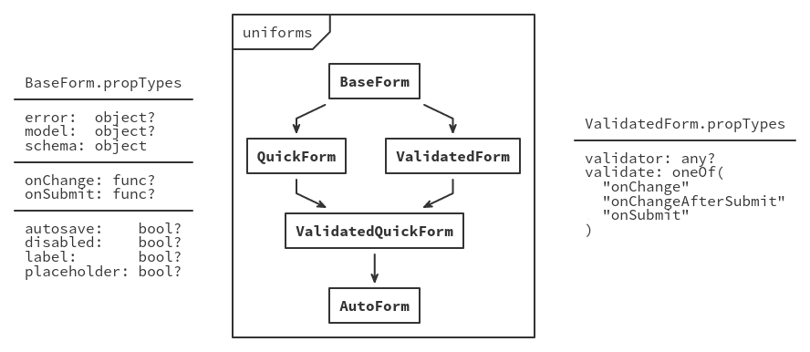

<p align="center">
    <a href="http://unicms.io">
        
    </a>

    <br>

    <a href="https://coveralls.io/github/vazco/uniforms">
        
    </a>

    <a href="https://npmjs.org/package/uniforms">
        
    </a>

    <a href="https://travis-ci.org/vazco/uniforms">
        
    </a>
</p>

# uniforms

In short: uniforms is a set of npm packages, which contains helpers and [React](https://facebook.github.io/react/) components - both unstyled and themed with [Bootstrap3](http://getbootstrap.com/), [Bootstrap4](http://v4-alpha.getbootstrap.com/) and [Semantic UI](http://semantic-ui.com/) - to easily manage, validate and even generate fully featured forms from your schemas.

<br>

<!-- START doctoc generated TOC please keep comment here to allow auto update -->
<!-- DON'T EDIT THIS SECTION, INSTEAD RE-RUN doctoc TO UPDATE -->
**Table of Contents**  *generated with [DocToc](https://github.com/thlorenz/doctoc)*

- [Installation](#installation)
    - [meteor](#meteor)
    - [npm](#npm)
- [Quick start](#quick-start)
- [Overview](#overview)
    - [Forms components](#forms-components)
    - [Fields components](#fields-components)
- [Advanced topics](#advanced-topics)
    - [Forms](#forms)
        - [Asynchronous validation](#asynchronous-validation)
        - [Autosave](#autosave)
        - [Hierarchy](#hierarchy)
        - [Post-submit handling](#post-submit-handling)
        - [Validation options and modes](#validation-options-and-modes)
        - [Example: `ModifierForm`](#example-modifierform)
    - [Fields](#fields)
        - [`AutoField` algorithm](#autofield-algorithm)
        - [Guaranteed props](#guaranteed-props)
        - [Props propagation](#props-propagation)
        - [Example: CustomAutoField](#example-customautofield)
        - [Example: CycleField](#example-cyclefield)
        - [Example: RatingField](#example-ratingfield)
    - [Schemas](#schemas)
        - [SimpleSchema definition](#simpleschema-definition)
        - [Example: MyLittleSchema](#example-mylittleschema)
    - [Context data](#context-data)
        - [Available context data](#available-context-data)
        - [Example: Conditional display](#example-conditional-display)
        - [Example: SubmitButton](#example-submitbutton)
        - [Example: SwapField](#example-swapfield)
- [API](#api)
- [Troubleshooting](#troubleshooting)
- [Contributing](#contributing)
- [Copyright and License](#copyright-and-license)

<!-- END doctoc generated TOC please keep comment here to allow auto update -->

<br>

# Installation

**Note:** If you are going to use a themed package - remember to include correct styles!

## meteor

These are npm packages, so they can't imply any Meteor package, and you have to install dependencies manually. In your Meteor app directory:

```shell
# If you are going to use SimpleSchema
$ meteor add aldeed:simple-schema check

# Components (pick one)
$ meteor npm install --save react react-dom uniforms uniforms-bootstrap3
$ meteor npm install --save react react-dom uniforms uniforms-bootstrap4
$ meteor npm install --save react react-dom uniforms uniforms-semantic
$ meteor npm install --save react react-dom uniforms uniforms-unstyled
```

## npm

```shell
# Components (pick one)
$ npm install --save react react-dom uniforms uniforms-bootstrap3
$ npm install --save react react-dom uniforms uniforms-bootstrap4
$ npm install --save react react-dom uniforms uniforms-semantic
$ npm install --save react react-dom uniforms uniforms-unstyled
```

<br>

# Quick start

**Note:** The following examples are designed to work out of box in meteor with `SimpleSchema` (a very common schema in meteor community), but it's not mandatory and you can easily use it without meteor and with different schemas (see: [Custom Schema](#custom-schema)).

Let's start with defining an example schema:

```js
import {SimpleSchema} from 'aldeed:simple-schema';

const PersonSchema = new SimpleSchema({
    name: {
        type: String,
        min: 3,
        max: 50
    },

    age: {
        type: Number,
        min: 0,
        max: 150
    }
});

const PostSchema = new SimpleSchema({
    category: {
        type: String,
        allowedValues: [
            "news",
            "image",
            "video"
        ]
    },

    authors: {
        type: [PersonSchema],
        minCount: 1,
        maxCount: 3
    },

    publishedDate: {
        type: Date
    },

    published: {
        type: Boolean,
        optional: true
    }
});
```

Then use it in your form:

```js
import {AutoForm} from 'uniforms-semantic'; // Remember to choose correct theme package

const PostCreateForm = () =>
    <AutoForm schema={PostSchema} onSubmit={doc => console.log(doc)} />
;

const PostUpdateForm = ({model}) =>
    <AutoForm schema={PostSchema} onSubmit={doc => console.log(doc)} model={model} />
;
```

That's all! `AutoForm` will generate complete form with labeled fields, an errors list (if any) and a submit button. Also, it will take care of validation and handling model changes.

<br>

# Overview

**Note:** For a full description of components and their props - see [API](#api).

## Forms components

Most of time you'll be using either `AutoForm` or `ValidatedForm`, but there are also other form components (rather low-level ones) with different capabilities.

| Component            | Self-generated? | Self-managed? | Self-validated? |
|:--------------------:|:---------------:|:-------------:|:---------------:|
| `AutoForm`           | ✔               | ✔             | ✔               |
| `BaseForm`           | ✘               | ✘             | ✘               |
| `QuickForm`          | ✔               | ✘             | ✘               |
| `ValidatedForm`      | ✘               | ✘             | ✔               |
| `ValidatedQuickForm` | ✔               | ✘             | ✔               |

## Fields components

This is a guaranteed set of fields - every theme package will implement these, but also can provide additional ones.

| Component       | Description                                     |
|:---------------:|:-----------------------------------------------:|
| `AutoField`     | Automatically renders given field.              |
| `AutoFields`    | Automatically renders given fields.             |
| `BoolField`     | Checkbox.                                       |
| `DateField`     | HTML5 `date-localtime` input.                   |
| `ErrorField`    | Error message for given field.                  |
| `ErrorsField`   | Error message with a list of validation errors. |
| `HiddenField`   | Hidden field (with possibility to omit in DOM). |
| `ListAddField`  | An icon with action to add list item.           |
| `ListDelField`  | An icon with action to remove list item.        |
| `ListField`     | List of nested fields.                          |
| `ListItemField` | Single list item wrapper.                       |
| `LongTextField` | Textarea.                                       |
| `NestField`     | Block of nested fields.                         |
| `NumField`      | Numeric input.                                  |
| `RadioField`    | Radio checkbox.                                 |
| `SelectField`   | Select (or set of radio checkboxes).            |
| `SubmitField`   | Submit button.                                  |
| `TextField`     | Text (or any HTML5 compatible) input.           |

<br>

# Advanced topics

## Forms

### Asynchronous validation

`ValidatedForm` (and so `AutoForm`) have an `onValidate` prop. It can be used to create an asynchronous validation:

```js
const onValidate = (model, error, callback) => {
    // You can either ignore validation error...
    if (omitValidation(model)) {
        return callback(null);
    }

    // ... or any additional validation if an error is already there...
    if (error) {
        return callback();
    }

    // ... or feed it with another error.
    MyAPI.validate(model, error => callback(error || null));
};

// Later...

<ValidatedForm {...props} onValidate={onValidate} />
```

### Autosave

Every form has an autosave functionality. If you set an `autosave` prop, then every change will trigger a submit. There's also an `autosaveDelay` prop - minimum time between saves in milliseconds (default: `0`).

**Example:**

```js
<AutoForm
    autosave
    autosaveDelay={5000} // 5 seconds
    schema={schema}
    onSubmit={onSubmit}
/>
```

### Hierarchy

<p align="center">
    
</p>

### Post-submit handling

It's a good UX practice to tell your users, that something failed or succeed. To make it simpler, there are `onSubmitFailure` and `onSubmitSuccess` props.

**Example:**

```js
<AutoForm
    schema={schema}
    onSubmit={doc => db.saveThatReturnsPromise(doc)}
    onSubmitSuccess={() => alert('Promise resolved!')}
    onSubmitFailure={() => alert('Promise rejected!')}
/>
```

### Validation options and modes

Form can be validated in one those three styles:

* `onChange`
    Validate on every change.

* `onChangeAfterSubmit` _(default)_
    Validate on every change, but only after first submit.

* `onSubmit`
    Validate on every submit.

If your schema validator accepts any options, those can be passed in `validator` prop.

**Example:**

```js
<AutoForm
    validate="onChange"
    validator={validatorOptions}
    schema={schema}
    onSubmit={onSubmit}
/>
```

### Example: `ModifierForm`

```js
import {BaseForm} from 'uniforms';
import {AutoForm} from 'uniforms-semantic'; // Remember to choose correct theme package

// In uniforms, every form is just an injectable set of functionalities. This way
// allows us to live without many higher order components in favor of composed one.
// If you want to get a deeper dive into it, read source of AutoForm or QuickForm
// in the core package.
const Modifier = parent => class extends parent {
    // Expose injector.
    // It's not required, but recommended.
    static Modifier = Modifier;

    // Alter component display name.
    // It's also not required, but recommended.
    static displayName = `Modifier${parent.displayName}`;

    // Here you can override any internal form methods or create additional ones.
    onSubmit (event) {
        // Prevent default form submission.
        // In this example, we are calling this.props.onSubmit directly, but
        // normally you can just call super.onSubmit(event) - it will handle
        // it by default.
        if (event) {
            event.preventDefault();
            event.stopPropagation();
        }

        if (this.props.onSubmit) {
            const doc  = this.getModel();
            const keys = this.getChildContextSchema().getSubfields();

            const update = keys.filter(key =>  doc[key]);
            const remove = keys.filter(key => !doc[key]);

            // It's a good idea to omit empty modifiers.
            if (update.length || remove.length) {
                const $set   = update.reduce((acc, key) => ({...acc, [key]: doc[key]}), {});
                const $unset = remove.reduce((acc, key) => ({...acc, [key]: ''}), {});

                this.props.onSubmit({
                    ...update.length && {$set},
                    ...remove.length && {$unset}
                });
            }
        }
    }
};

// Now we have to inject our functionality.
// This one can be called a ModifierBaseForm.
export default Modifier(BaseForm);

// Every functionality have to be overriden independently. This might seem a
// little bit crazy, but we have to override BaseForm#onSubmit. If you are
// using for example Bootstrap3, then change AutoForm.Semantic to AutoForm.Bootstrap3.
// This one can be called AutoModifierForm.
export default AutoForm.Auto(AutoForm.Validated(AutoForm.Quick(AutoForm.Semantic(Modifier(BaseForm)))));
```

## Fields

### `AutoField` algorithm

```js
let component = props.component;
if (component === undefined) {
    if (props.allowedValues) {
        if (props.checkboxes && props.fieldType !== Array) {
            component = RadioField;
        } else {
            component = SelectField;
        }
    } else {
        switch (props.fieldType) {
            case Date:    component = DateField; break;
            case Array:   component = ListField; break;
            case Number:  component = NumField;  break;
            case Object:  component = NestField; break;
            case String:  component = TextField; break;
            case Boolean: component = BoolField; break;
        }

        invariant(component, 'Unsupported field type: %s', props.fieldType.toString());
    }
}
```

### Guaranteed props

**Note:** These are **not** the only props, that field will receive - these are guaranteed for all fields created with `connectField` helper.

| Name           | Type                  | Description                            |
|:--------------:|:---------------------:|:--------------------------------------:|
| `changed`      | `bool`                | Has field changed?                     |
| `disabled`     | `bool`                | Is field disabled?                     |
| `error`        | `object`              | Field scoped part of validation error. |
| `errorMessage` | `string`              | Field scoped validation error message. |
| `field`        | `object`              | Field definition from schema.          |
| `fields`       | `arrayOf(string)`     | Subfields names.                       |
| `fieldType`    | `func`                | Field type.                            |
| `findError`    | `func(name)`          | Request another field error.           |
| `findField`    | `func(name)`          | Request another field field.           |
| `findValue`    | `func(name)`          | Request another field value.           |
| `id`           | `string`              | Field id - given or random.            |
| `label`        | `string`              | Field label.                           |
| `name`         | `string`              | Field name.                            |
| `onChange`     | `func(value, [name])` | Change field value.                    |
| `parent`       | `object`              | Parent field props.                    |
| `placeholder`  | `string`              | Field placeholder.                     |
| `value`        | `any`                 | Field value.                           |

### Props propagation

Few props propagate in a very special way. These are `label`, `placeholder` and `disabled`.

**Example:**

```js
<TextField />                    // default label | no      placeholder
<TextField label="Text" />       // custom  label | no      placeholder
<TextField label={false} />      // no      label | no      placeholder
<TextField placeholder />        // default label | default placeholder
<TextField placeholder="Text" /> // default label | custom  placeholder

<NestField label={null}> // null = no label, but children have their labels
    <TextField />
</NestField>

<NestField label={false}> // false = no label and their children have no labels
    <TextField />
</NestField>

<ListField name="authors" disabled>   // Additions are disabled...
    <ListItemField name="$" disabled> // deletion too...
        <NestField disabled={false}>  // but editing is not.
            <TextField name="name" />
            <NumField  name="age" />
        </NestField>
    </ListItemField>
</ListField>
```

**Note:** `label`, `placeholder` and `disabled` are casted to `Boolean` before being passed to nested fields.

### Example: CustomAutoField

**Note:** This example uses `connectField` helper. To read more see [API](#api).

```js
import {AutoField} from 'uniforms-semantic'; // Remember to choose correct theme package

const CustomAuto = props => {
    // This way we don't care about not handled cases - we use default
    // AutoField as a fallback component.
    const Component = determineComponentFromProps(props) || AutoField;

    return (
        <Component {...props} />
    );
};

const CustomAutoField = connectField(CustomAuto, {ensureValue: false, includeInChain: false, initialValue: false});
```

You can also tell your `AutoForm`/`QuickForm`/`ValidatedQuickForm` to use it.

```js
<AutoForm {...props} autoField={CustomAutoField} />
```

### Example: CycleField

**Note:** This example uses `connectField` helper. To read more see [API](#api).

```js
import React          from 'react';
import classnames     from 'classnames';
import {connectField} from 'uniforms';

// This field works like this: cycle all allowed values and optionally
// no-value state if field is not required. This one uses Semantic-UI.
const Cycle = ({allowedValues, disabled, label, required, value, onChange}) =>
    <a
        className={classnames('ui', !value && 'basic', 'label')}
        onClick={() =>
            onChange(value
                ? allowedValues.indexOf(value) === allowedValues.length - 1
                    ? required
                        ? allowedValues[0]
                        : null
                    : allowedValues[allowedValues.indexOf(value) + 1]
                : allowedValues[0]
            )
        }
    >
        {value || label}
    </a>
;

export default connectField(Cycle);
```

### Example: RatingField

**Note:** This example uses `connectField` helper. To read more see [API](#api).

```js
import React          from 'react';
import classnames     from 'classnames';
import {connectField} from 'uniforms';

// This field works like this: render stars for each rating and mark them
// as filled, if rating (value) is greater. This one uses Semantic-UI.
const Rating = ({className, disabled, max = 5, required, value, onChange}) =>
    <section className={classnames('ui', {disabled, required}, className, 'rating')}>
        {[...Array(max)].map((_, index) => index + 1).map(index =>
            <i
                key={index}
                className={classnames(index <= value && 'active', 'icon')}
                onClick={() => disabled || onChange(!required && value === index ? null : index)}
            />
        )}
    </section>
;

export default connectField(Rating);
```

## Schemas

To make use of any schema, uniforms have to create a _bridge_ of it - unified schema mapper. A bridge is (preferably) a subclass of `Bridge`, implementing static `check(schema)` method and these instance methods:

- `getError(name, error)`
- `getErrorMessage(name, error)`
- `getErrorMessages(error)`
- `getField(name)`
- `getInitialValue(name, props)`
- `getProps(name, props)`
- `getSubfields(name)`
- `getType(name)`
- `getValidator(options)`

Currently there's only one built in bridge - `SimpleSchemaBridge`.

**Note:** To read more see [API](#api), [`Bridge`](https://github.com/vazco/uniforms/blob/master/packages/uniforms/src/bridges/Bridge.js) and [`SimpleSchemaBridge`](https://github.com/vazco/uniforms/blob/master/packages/uniforms/src/bridges/SimpleSchemaBridge.js).

### SimpleSchema definition

**Note:** remember to import `uniforms` packages first.

```js
const PersonSchema = new SimpleSchema({
    // ...

    aboutMe: {
        type: String,
        uniforms: MyText       // Component...
        uniforms: {            // ... or object ...
            component: MyText, // ... with component ...
            propA: 1           // ... and/or extra props.
        }
    }
});
```

### Example: MyLittleSchema

**Note:** This is a very basic schema just to show how it works and how can you create your own schema bridges.

```js
import {Bridge} from 'uniforms';

class MyLittleSchema extends Bridge {
    constructor (schema, validator) {
        super(schema);

        this.validator = validator;
    }

    getError (name, error) {
        return error && error[name];
    }

    getErrorMessage (name, error) {
        return error && error[name];
    }

    getErrorMessages (error) {
        return error
            ? Object.keys(this.schema).map(field => error[field])
            : [];
    }

    getField (name) {
        return this.schema[name.replace(/\.\d+/g, '.$')];
    }

    getType (name) {
        return this.schema[name.replace(/\.\d+/g, '.$')].__type__;
    }

    getProps (name) {
        return this.schema[name.replace(/\.\d+/g, '.$')];
    }

    getInitialValue (name) {
        return this.schema[name.replace(/\.\d+/g, '.$')].initialValue;
    }

    getSubfields (name) {
        return name
            ? this.schema[name.replace(/\.\d+/g, '.$')].subfields || []
            : Object.keys(this.schema).filter(field => field.indexOf('.') === -1);
    }

    getValidator () {
        return this.validator;
    }
}

const ExampleOfMyLittleSchema = new MyLittleSchema({
    login:     {__type__: String, required: true, initialValue: '', label: 'Login'},
    password1: {__type__: String, required: true, initialValue: '', label: 'Password'},
    password2: {__type__: String, required: true, initialValue: '', label: 'Password (again)'}
}, model => {
    const error = {};

    if (!model.login) {
        error.login = 'Login is required!';
    } else if (model.login.length < 5) {
        error.login = 'Login have to be at least 5 characters!';
    }

    if (!model.password1) {
        error.password1 = 'Password is required!';
    } else if (model.password1.length < 10) {
        error.login = 'Password have to be at least 10 characters!';
    }

    if (model.password1 !== model.password2) {
        error.password1 = 'Passwords mismatch!';
    }

    if (Object.keys(error).length) {
        throw error;
    }
});

<AutoForm schema={ExampleOfMyLittleSchema} />
```

## Context data

Some components might need to know current form state. All this this data is passed as `uniforms` in [React context](https://facebook.github.io/react/docs/context.html).

### Available context data

```js
MyComponentUsingUniformsContext.contextTypes = {
    uniforms: PropTypes.shape({
        name: PropTypes.arrayOf(PropTypes.string).isRequired,

        error: PropTypes.any,
        model: PropTypes.object.isRequired,

        schema: PropTypes.shape({
            getError:         PropTypes.func.isRequired,
            getErrorMessage:  PropTypes.func.isRequired,
            getErrorMessages: PropTypes.func.isRequired,
            getField:         PropTypes.func.isRequired,
            getInitialValue:  PropTypes.func.isRequired,
            getProps:         PropTypes.func.isRequired,
            getSubfields:     PropTypes.func.isRequired,
            getType:          PropTypes.func.isRequired,
            getValidator:     PropTypes.func.isRequired
        }).isRequired,

        state: PropTypes.shape({
            changed:    PropTypes.bool.isRequired,
            changedMap: PropTypes.object.isRequired,

            label:       PropTypes.bool.isRequired,
            disabled:    PropTypes.bool.isRequired,
            placeholder: PropTypes.bool.isRequired
        }).isRequired,

        onChange: PropTypes.func.isRequired,
        randomId: PropTypes.func.isRequired
    }).isRequired
};
```

### Example: Conditional display

```js
import {BaseField} from 'uniforms';
import {Children}  from 'react';
import {nothing}   from 'uniforms';

// We have to ensure, that there's only one children, because
// returning an array from component is prohibited.
const DisplayIf = ({children, condition}, {uniforms}) =>
    condition(uniforms)
        ? Children.only(children)
        : nothing
;

DisplayIf.contextTypes = BaseField.contextTypes;

export default DisplayIf;
```

**Example:**

```js
const ThreeStepForm = ({schema}) =>
    <AutoForm schema={schema}>
        <TextField name="fieldA" />

        <DisplayIf condition={context => context.model.fieldA}>
            <section>
                <TextField name="fieldB" />

                <DisplayIf condition={context => context.model.fieldB}>
                    <span>
                        Well done!
                    </span>
                </DisplayIf>
            </section>
        </DisplayIf>
    </AutoForm>
;
```

### Example: SubmitButton

```js
import React            from 'react';
import {BaseField}      from 'uniforms';
import {filterDOMProps} from 'uniforms';

// This field works like this: render standard submit field and
// disable it, when form is invalid. It's simplified version of
// default SubmitField from uniforms-semantic.
const SubmitField = (props, {uniforms: {error, state: {disabled}}}) =>
    <input type="submit" disabled={!!(error || disabled)} />
;

SubmitField.contextTypes = BaseField.contextTypes;

export default SubmitField;
```

### Example: SwapField

```js
import get            from 'lodash.get';
import {Children}     from 'react';
import {BaseField}    from 'uniforms';
import {cloneElement} from 'react';

// This field works like this: on click of it's child it
// swaps values of fieldA and fieldB. Simple.
const SwapField = ({children, fieldA, fieldB}, {uniforms: {model, onChange}}) =>
    cloneElement(Children.only(children), {
        onClick () {
            const valueA = get(model, fieldA);
            const valueB = get(model, fieldB);

            onChange(fieldA, valueB);
            onChange(fieldB, valueA);
        }
    })
;

SwapField.contextTypes = BaseField.contextTypes;

export default SwapField;
```

**Example:**

```js
<section>
    <TextField name="firstName" />
    <SwapField fieldA="firstName" fieldB="lastName">
        <Icon name="refresh" />
    </SwapField>
    <TextField name="lastName" />
</section>
```

<br>

# API

See [API.md](https://github.com/vazco/uniforms/blob/master/API.md).

<br>

# Troubleshooting

> `The specified value "..." is not a valid email address.`

Your browser is trying to do it best. Those warnings are harmless, but currently there's no way to get rid of them, other than downgrading to React `15.1.0` or using different browser.

<br>

# Contributing

See [CONTRIBUTING.md](https://github.com/vazco/uniforms/blob/master/CONTRIBUTING.md).

<br>

# Copyright and License

Code and documentation &copy; 2016 [Vazco.eu](http://vazco.eu)
Released under the MIT license.

This package is part of [Universe](http://unicms.io), a package ecosystem based on [Meteor platform](http://meteor.com) maintained by [Vazco](http://www.vazco.eu).
It works as standalone Meteor package, but you can get much more features when using the whole system.

<style>
    /* Full width tables */
    .markdown-body table {
        display:  table;
    }
</style>
